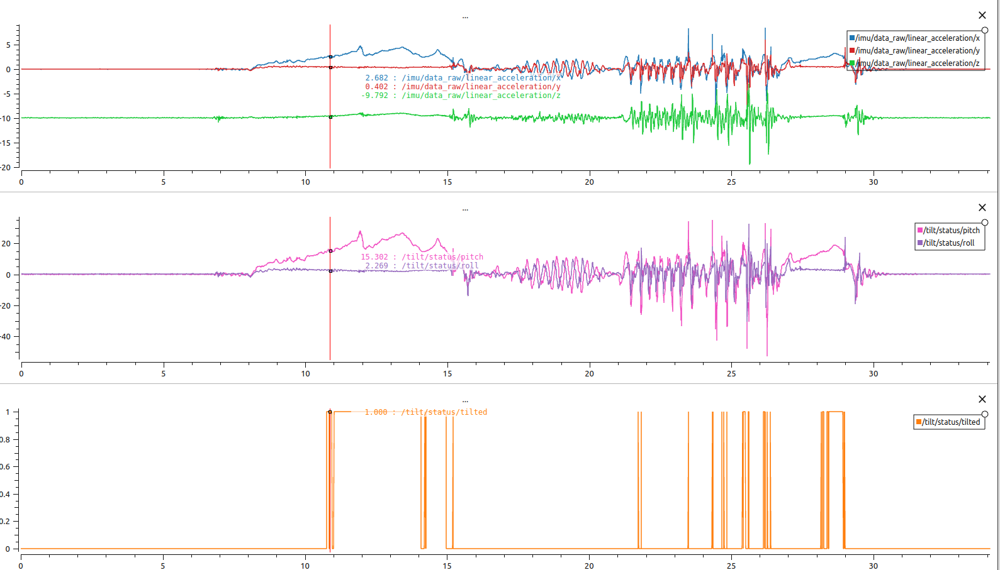

# IMU Tilt Detection ROS2 Package

This ROS2 package, **tilt_detection**, uses an IMU accelerometer to detect tilt and inversion of a robot during autonomous operation.

## Input & Output

- **Input:** `/imu/data_raw` : `sensor_msgs/Imu` (IMU accelerometer data)
- **Output:** 
    - `/tilt/status` : `tilt_detection/TiltStatus` (Tilt status, `True` > 15° tilt, `False` otherwise)

## Run

- Playback the data with: `ros2 bag play -l recorded_output/shaking_and_tilting_robot_bag/`. This publishes `/imu/data_raw`.
- Run with `ros2 run imu_tilt_detection tilt_publisher`
- Tests can be run with: `colcon test --ctest-args tests && colcon test-result --all --verbose`

## Explanations

**TiltPublisher** node that subscribes to `/imu/data_raw`, uses TiltDetector and published the computed status on `/tilt/status` at the same frequency. It also publishes to `/diagnostics` if there is no IMU data for more than 2 secs.

**TiltDetector** computes the tilt given accelerations. It uses the direction of the gravity acceleration vector over 100 points and takes the mean to detect if the robot is tilted or not.
Functions:
- compute_roll_deg_from_acceleration(double x, double y, double z) -> double
- compute_pitch_deg_from_acceleration(double x, double y, double z) -> double
- compute_tilt_status_from_acceleration(double x, double y, double z) -> bool

## Development

Tested on ROS2 Iron (Ubuntu 22.04).

## Results

With 100pts (1sec) smooth

The complementary filter that takes into account gyro rate provides more smoothed angle and a tilt status that is very similar but more reactive.

